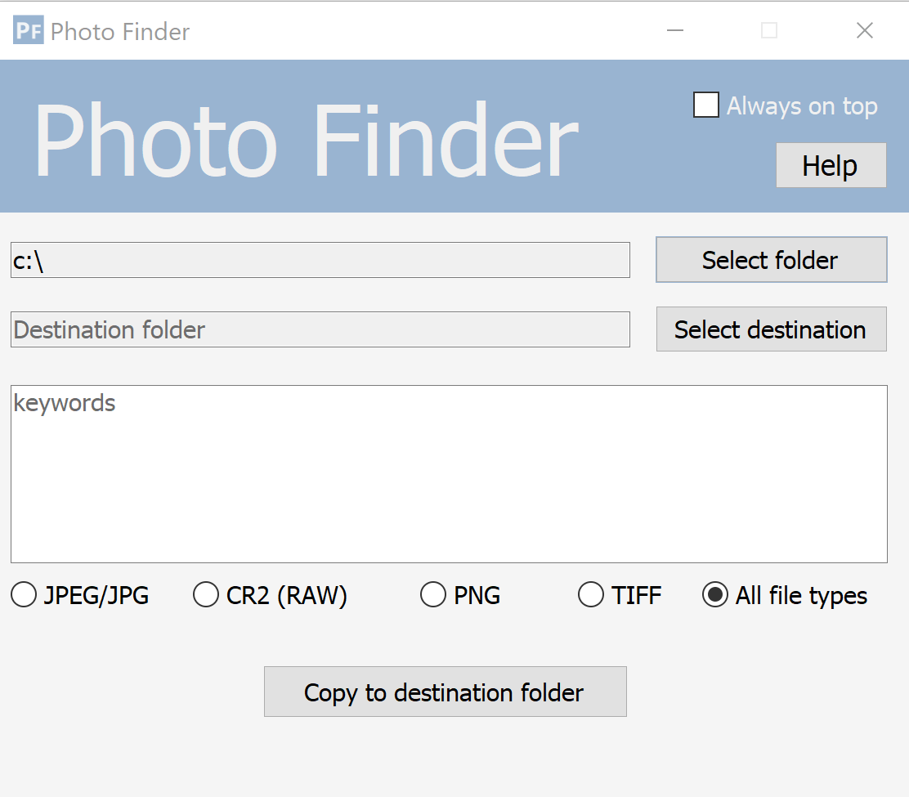
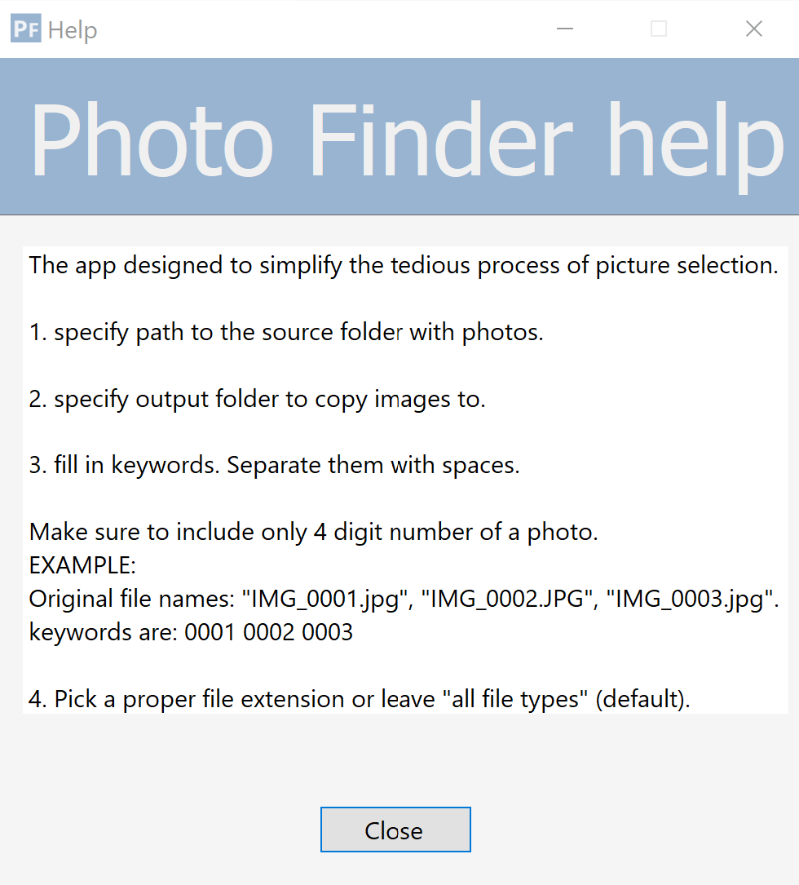

[![Badge License]][License]   


<!----------------------------------{ Licenses }------------------------------->

[License]: https://en.wikipedia.org/wiki/MIT_License


<!----------------------------------{ Badges }--------------------------------->

[Badge License]: https://img.shields.io/badge/License-MIT-yellow.svg?style=for-the-badge

The "Photo Finder" desktop application helps photographers to pick and copy multiple photos.\
The app simply copies specified files into specified folder.\
It utilized batch processing features and makes the tedious process a bit easier.

<details>
  <summary><i>UI Screenshots</i></summary>




</details>

## How to build and run

The app runs exclusively on Windows.

> 1. Assume the app located in "home" directory.
navigate to the project folder:
> ```
> cd ~/PhotoFinderApp/PhotoFinder
> ```
> 2. Build the application
> ```
> dotnet build
>```
> 3. Run the app
>```
> dotnet run
> ```

## How to use

The app designed to simplify the tedious process of picture selection.
Imagine you have to pick multiple photos from a folder and it's subfolders.\
The app allows to add file names and copy the files to a specified folder.

#### Typical workflow:

1. specify path to the source folder with photos.

2. specify output folder to copy images to.

3. fill in keywords. Separate them with spaces.

   Make sure to include only 4 digit number of a photo.

   EXAMPLE:\
   Original file names: "IMG_0001.jpg", "IMG_0002.JPG", "IMG_0003.jpg".
   keywords are: 0001 0002 0003

4. Pick a proper file extension or leave "all file types" (default).

## Dependencies

The Photo Finder targets **.NET 7**
